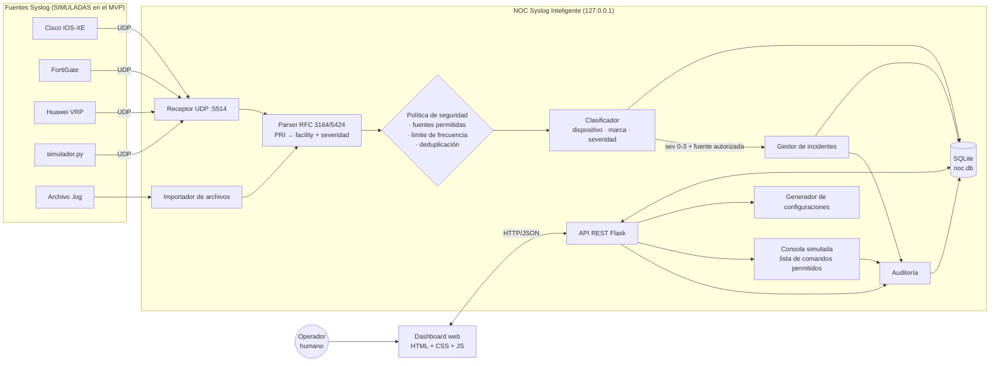
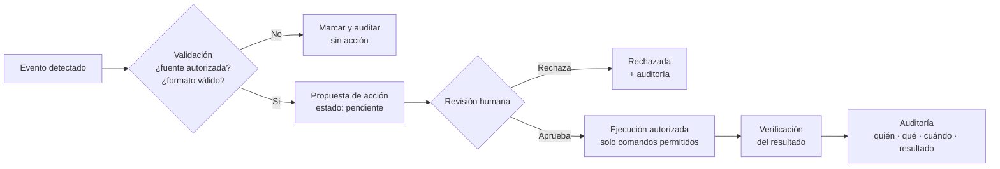
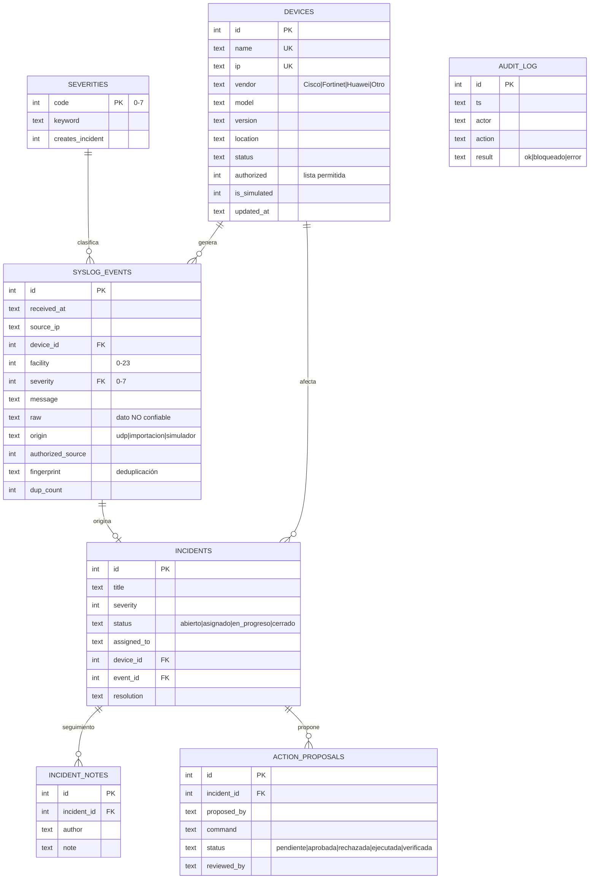

# 3. Diseño de la solución

## 3.1 Arquitectura general

Aplicación monolítica en capas, ejecutada localmente:

## 3.2 Flujo seguro de acciones (obligatorio)

Ninguna acción sobre un equipo se ejecuta sin pasar por todos los pasos. Un asistente de IA
solo puede **proponer** acciones; no puede aprobarlas ni ejecutarlas.

## 3.3 Modelo de datos

## 3.4 Módulos

| Módulo | Archivo(s) | Responsabilidad | Fase |
|---|---|---|---|
| Configuración | `app/config.py`, `.env` | Variables de entorno, sin secretos en el código | 1 |
| Datos | `app/db.py`, `app/schema.sql` | Conexión, esquema y auditoría | 1 |
| Inventario | `app/devices.py` | CRUD de equipos | 2 |
| Syslog | `app/syslog_parser.py`, `app/receiver.py` | Parser, receptor UDP, importación | 2 |
| Seguridad | `app/security.py` | Fuentes permitidas, deduplicación, límite de frecuencia | 2–4 |
| Incidentes | `app/incidents.py` | Ciclo de vida y propuestas de acción | 3 |
| Dashboard | `app/static/`, `app/templates/` | Interfaz web | 3 |
| Configuraciones | `app/configgen.py` | Plantillas Cisco, Fortinet y Huawei | 4 |
| Consola | `app/console.py` | Comandos permitidos y bloqueados | 4 |

## 3.5 Decisiones técnicas

| Decisión | Justificación |
|---|---|
| Flask en lugar de FastAPI | Sin dependencias compiladas; instalación confiable en Windows con Python 3.14; código fácil de explicar |
| SQLite | Viene con Python; un solo archivo; suficiente para el MVP |
| Puerto UDP 5514 | El puerto 514 requiere permisos de administrador; en los equipos se configura el puerto destino |
| Fechas en UTC | Correlación entre equipos de distintas zonas; se complementa con NTP |
| IP RFC 5737 en los datos simulados | Garantiza que no se usen IP reales de producción |
